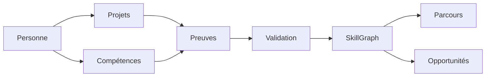

# HashCode SkillGraph

> Infrastructure reliant compétences, preuves de capacité, projets et opportunités pour réduire la distance entre apprentissage et emploi.

**Domaine:** Web & Software Engineering · **Programme:** HashCode Global Impact · **Statut:** Research / MVP discovery

## Problème
Une liste de diplômes ou technologies ne suffit pas toujours à rendre une capacité observable. SkillGraph relie compétences, preuves, projets et opportunités.

## Vision
`Compétence → Preuve → Projet → Validation → Opportunité`

## Cartographie

## MVP
Profil de compétences, portfolio de preuves, projets, contributions open source, validation par pairs, parcours d'apprentissage et API de profil.

## Principes
Les scores ne sont pas des verdicts. Chaque affirmation doit être accompagnée de preuves, provenance, date et limites.

## Impact
Taux compétence→opportunité, délai vers une première mission, preuves validées et progression mesurée.

## Contribuer
Voir : https://github.com/HashCode-Reboot/hashcode-contributors

**Doctrine HashCode:** *Build for Africa. Scale for Humanity.*