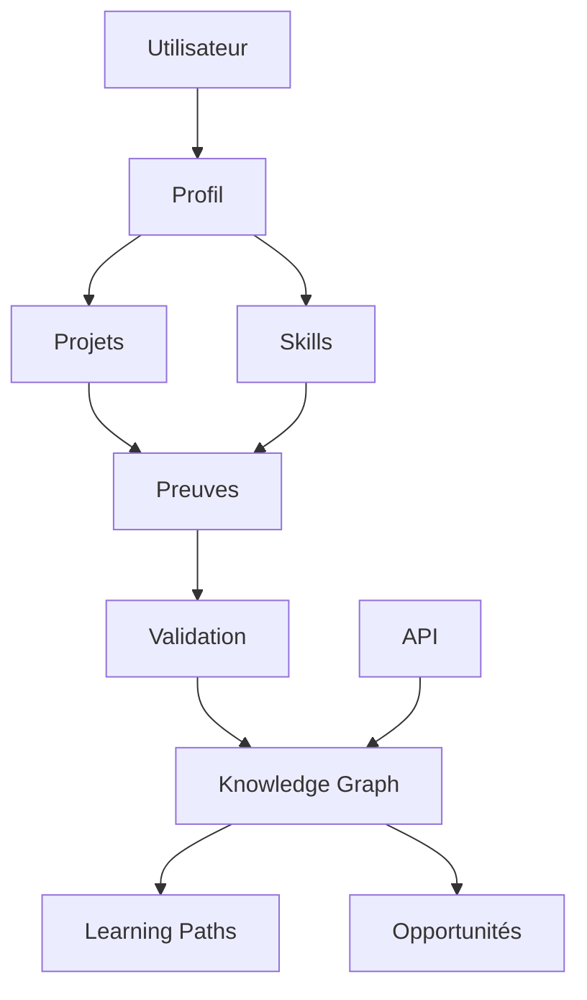

# Architecture — SkillGraph

## Principes

Les preuves sont premières : source, auteur, date, contexte et méthode de validation doivent être conservés. Les recommandations ne doivent pas être présentées comme des décisions définitives sur une personne.

Une architecture graphe peut être complétée par PostgreSQL pour les données transactionnelles et un moteur de recherche/graph pour les relations complexes.